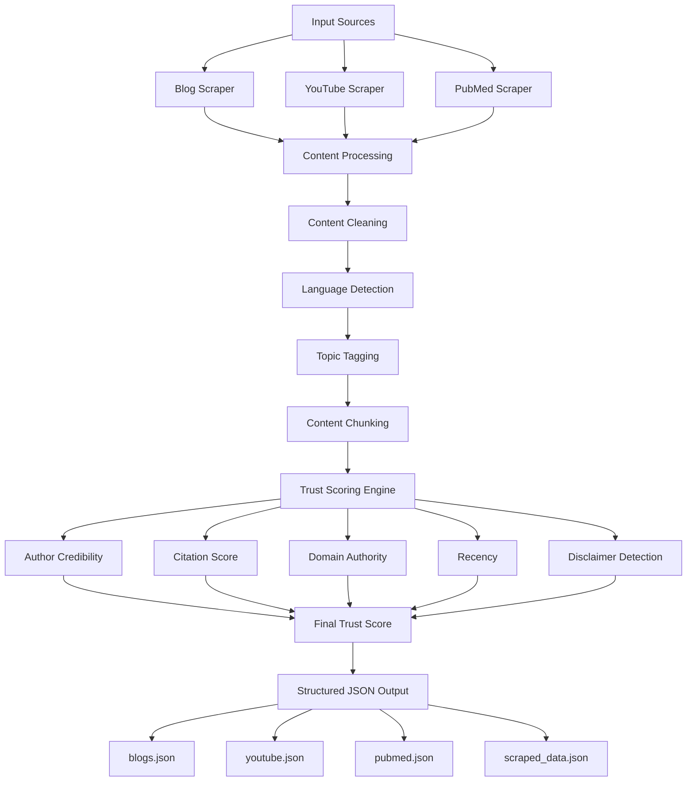

# 🧠 Multi-Source Data Scraping & Trust Scoring System

## 🚀 Overview
This project implements a multi-source data scraping pipeline combined with a trust scoring system to evaluate the reliability of content from different platforms.

The system collects structured data from blogs, YouTube videos, and PubMed articles, processes unstructured content, and assigns a trust score (0–1) based on credibility factors.

This system is designed to simulate real-world data pipelines used in AI systems such as RAG and content reliability evaluation.

---

## ✨ Key Features

- 🔍 Multi-source scraping:
  - 3 Blog posts  
  - 2 YouTube videos  
  - 1 PubMed article  

- 🧾 Metadata extraction:
  - Author / Publisher  
  - Publication date  
  - Title & description  

- 🧹 Content cleaning:
  - Removes UI noise (ads, navigation, links)

- 🏷️ Automatic topic tagging  
- ✂️ Content chunking for downstream AI use  
- 📊 Trust scoring system (0–1 scale)

---

## 🏗️ Architecture



---

## 📁 Project Structure

```bash
project/
├── scraper/
│   ├── blog_scraper.py
│   ├── youtube_scraper.py
│   └── pubmed_scraper.py
│
├── scoring/
│   └── trust_score.py
│
├── utils/
│   ├── tagging.py
│   ├── chunking.py
│   └── language.py
│
├── output/
│   ├── blogs.json
│   ├── youtube.json
│   ├── pubmed.json
│   └── scraped_data.json
│
├── main.py
├── requirements.txt
├── README.md
├── report.pdf
└── .gitignore
```


---

## 🛠️ Tools & Technologies

- Python  
- BeautifulSoup & Requests (Web scraping)  
- yt-dlp (YouTube metadata)  
- youtube-transcript-api (transcripts)  
- BioPython Entrez (PubMed API)  
- Langdetect (language detection)  

---

## 🔎 Scraping Approach

### 📰 Blogs
- Extracted article text using BeautifulSoup  
- Removed navigation elements and UI noise  
- Parsed metadata from HTML meta tags  

### 🎥 YouTube
- Metadata extracted via yt-dlp  
- Transcript retrieved using API  
- Cleaned timestamps, URLs, and noise  

### 🧬 PubMed
- Used Entrez API for structured retrieval  
- Extracted authors, journal, abstract, and year  

---

## 🏷️ Topic Tagging

- Rule-based keyword matching  
- Generates tags based on content  
- Fallback tag (`"general"`) if no keywords found  

---

## 📊 Trust Score Design

The system evaluates the reliability of each source using a weighted trust scoring function. The score ranges from **0 to 1**, where higher values indicate more trustworthy content.

### 🔢 Formula

Trust Score is calculated as:

Trust Score =
0.25 × Author Credibility +
0.20 × Citation Score +
0.20 × Domain Authority +
0.20 × Recency +
0.15 × Medical Disclaimer Presence

---

### ⚙️ Scoring Components

#### 1. Author Credibility
- Multiple authors → Higher credibility  
- Known author → Moderate score  
- Missing/unknown author → Low score  

#### 2. Citation Score
- PubMed articles → High (peer-reviewed)  
- YouTube → Medium  
- Blogs → Lower  

#### 3. Domain Authority
- Trusted domains (e.g., PubMed, Nature) → High  
- Medium platforms (Medium, Analytics Vidhya) → Moderate  
- Unknown domains → Penalized  

#### 4. Recency
- Recent content (last 1 year) → High  
- Moderately old (1–3 years) → Medium  
- Old content → Low  

#### 5. Medical Disclaimer Presence
- Content with safety disclaimers → Higher score  
- No disclaimer → Penalized  

---

### 🎯 Final Score
The final trust score is computed as a weighted sum of all components and is normalized to remain within the range **[0, 1]**.

---

### 🧠 Design Rationale
- Combines **content quality + source credibility**
- Prioritizes **reliable and recent information**
- Penalizes **low-quality or potentially misleading content**

---

## ⚠️ Edge Case Handling

- Missing author/date → fallback to `"unknown"`  
- Missing transcript → fallback to description/title  
- Multiple authors → higher credibility score  
- Non-English content → automatic detection  
- Empty content → fallback mechanism applied  
- Long articles → split into chunks  

---

## 🛡️ Abuse Prevention Logic

- 🚫 Fake authors → penalized via low credibility  
- 🚫 SEO spam → penalized using domain authority  
- 🚫 Misleading medical content → penalized if no disclaimer  
- 🚫 Outdated content → recency-based penalty  

---

## ⚙️ How to Run

### 1. Install dependencies:

```bash
pip install -r requirements.txt
```

### 2. Run:

```bash
python main.py
```

3. Output will be generated in:
- Total sources processed: **6**

```bash
output/
```

---

## 📦 Output Files

- `blogs.json` → Blog data  
- `youtube.json` → YouTube data  
- `pubmed.json` → PubMed data  
- `scraped_data.json` → Combined dataset  

---

## 📌 Limitations

- Rule-based tagging (not ML-based)  
- Domain authority is manually defined  
- Some websites may restrict scraping  
- Transcript availability depends on video  

---

## 🧾 Summary

This project demonstrates building a scalable data pipeline that integrates multiple sources, processes unstructure data, and evaluates content reliability using a structured trust scoring system.

---

## Project Maintainer
**Github:** [Swedeshna Mishra](https://github.com/SwedeshnaMishra)
